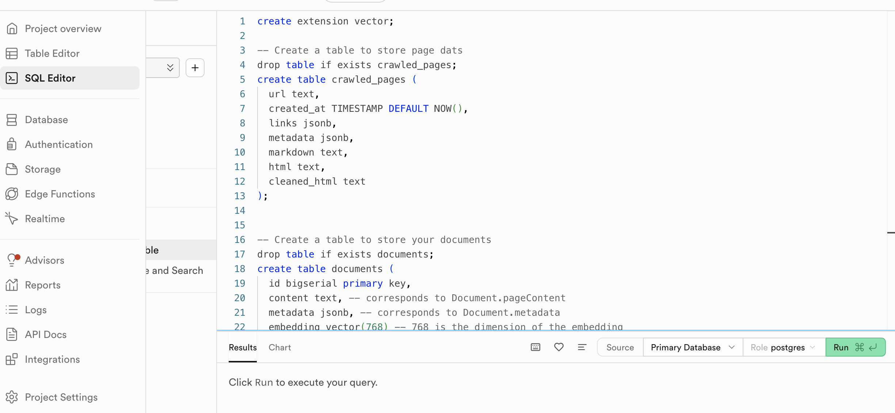
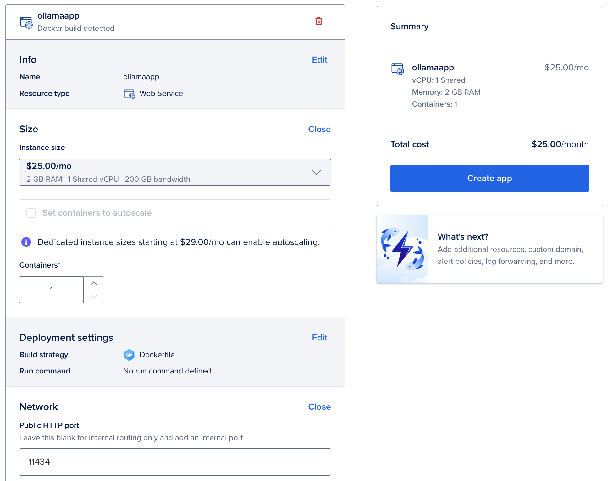
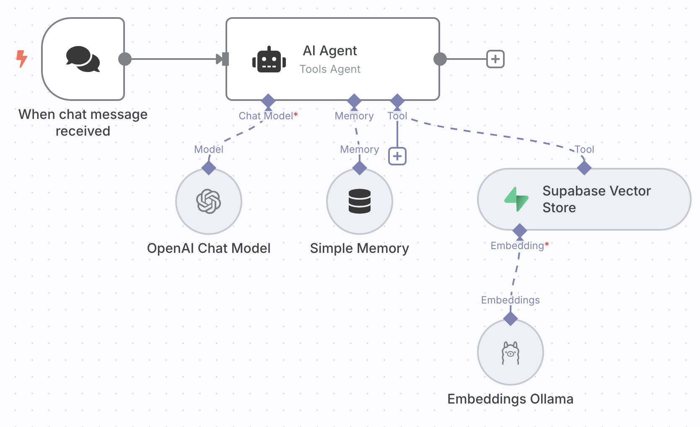
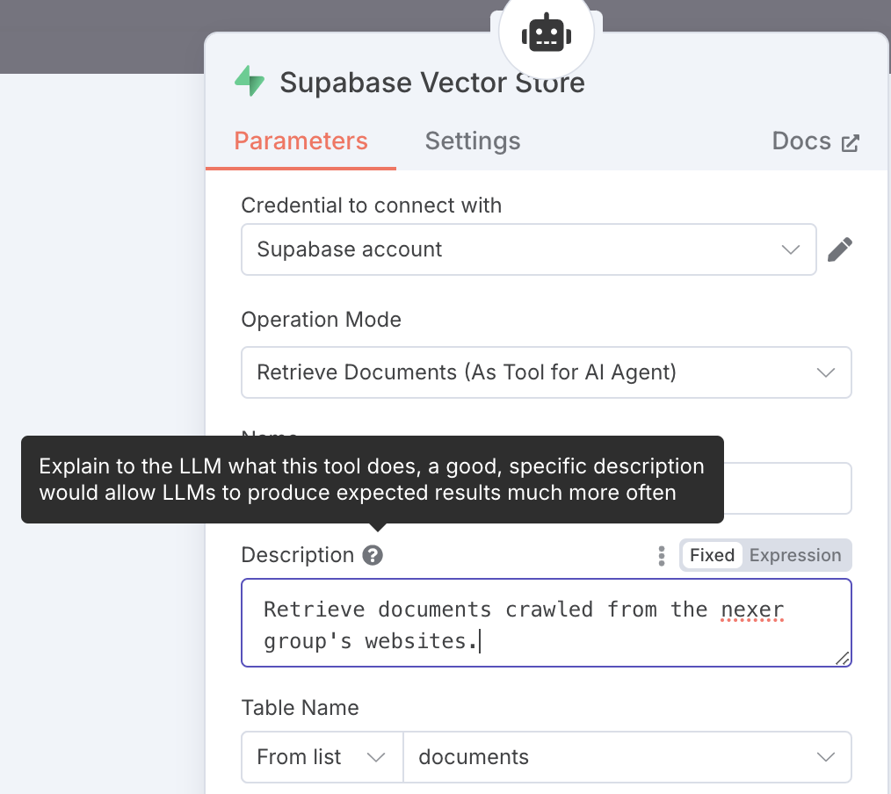
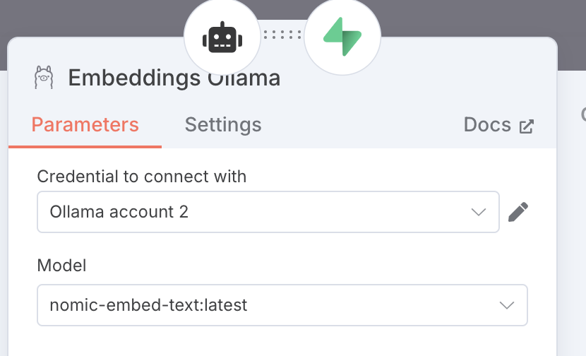
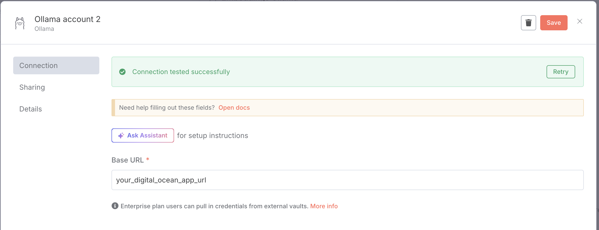

# A simple RAG on crawled data
combining crawl4AI , supabase and n8n

## **Retrieval-Augmented Generation (RAG) - A brief overview**

Retrieval-Augmented Generation (RAG) is a powerful technique that combines the generative strength of large language models (LLMs) with the precision of retrieval-based systems. Instead of relying solely on a model’s internal knowledge, RAG pipelines dynamically pull in relevant external data—like documents, websites, or databases—at query time. This dramatically improves the factual accuracy and adaptability of LLMs, especially in domain-specific or frequently updated contexts.

At its core, a RAG workflow retrieves contextually relevant chunks of information using semantic search (typically via vector embeddings), then passes this context along with the user’s question into an LLM. The result is a grounded, contextualized answer that’s both coherent and informed by up-to-date data. Whether you're building an internal knowledge assistant or a public-facing chatbot, RAG helps ensure your AI is informed, not just intelligent.


## The services and tech needed to crawl a website and chat with the content
We'll briefly cover the various parts of our RAG prototype made of:
- a python repo to run **Crawl4AI** locally and embed the documents using a local ollama container
- a **Supabase** database to hold the data (hosted by supabase so n8n can access it remotely)
- **n8n** to create a workflow with a chat and AI agent functionality
- an **Ollama** service deployed on **Digital Ocean** (so n8n can access it remotely)


### n8n
[**n8n**](https://n8n.io/) is an open-source, low-code workflow automation tool that allows you to connect APIs, services, and custom logic with ease. It provides a visual interface where users can build complex automation pipelines by simply dragging and dropping nodes. With native support for hundreds of integrations and the ability to run JavaScript code or call webhooks, n8n is a powerful platform for orchestrating data flows—perfect for building Retrieval-Augmented Generation (RAG) applications that combine scraping, embedding, storage, and AI querying into a seamless process. You can either use the hosted version or self-host wherever you like. Sign-up and start automating 


### Supabase 
[**Supabase**](https://supabase.com/) is an open-source backend-as-a-service that offers a powerful alternative to Firebase, built on top of PostgreSQL. It provides a fully managed database, real-time subscriptions, authentication, storage, and RESTful or GraphQL APIs out of the box. With a developer-friendly interface and tight integration with modern toolchains, Supabase is ideal for hosting and querying embedded data in RAG applications, enabling fast, scalable, and secure data access.

### Crawl4AI
[**Crawl4AI**](https://docs.crawl4ai.com/) is a lightweight, open-source web crawling framework designed specifically for AI and machine learning use cases. It simplifies the process of extracting structured content from websites, making it easy to gather high-quality text data for tasks like training models or building RAG pipelines. With built-in support for filtering, rate limiting, and customizable parsing logic, Crawl4AI is ideal for developers looking to integrate clean, domain-specific data into LLM workflows.


### LLaMA and ollama
[**LLaMA (Large Language Model Meta AI)**](https://www.llama.com/) is a family of open-source large language models developed by Meta, designed to provide high performance while being more resource-efficient than many other models in the same class. LLaMA models have been widely adopted in the AI community for their accessibility, strong multilingual capabilities, and ease of fine-tuning on domain-specific tasks. They are particularly well-suited for building local, privacy-respecting applications such as RAG (retrieval-augmented generation) systems, chatbots, and summarizers—especially when low-latency inference is required without relying on external APIs.

[**Ollama**](https://ollama.com/) is a developer-friendly tool that simplifies the deployment and management of LLaMA and other open-source language models via Docker containers (see [git-repo](https://github.com/ollama/ollama) and [docker-hub](https://hub.docker.com/r/ollama/ollama)). It abstracts away the complexity of setting up inference servers by offering a clean interface to run models locally with just a few commands. With Ollama, you can easily load, switch, and interact with LLaMA models using HTTP endpoints—making it an excellent choice for embedding models into workflows like n8n or integrating with data pipelines hosted on platforms like Supabase. This streamlined setup allows developers to run powerful LLMs on their own infrastructure, reducing dependencies on cloud-based services and improving control over cost and data privacy.

### Digital Ocean
[**DigitalOcean**](https://www.digitalocean.com/) is a cloud infrastructure provider known for its simplicity and developer-friendly tools. It offers scalable virtual machines (droplets), managed databases, and Kubernetes clusters, making it a popular choice for hosting applications, including LLM inference servers like Ollama, for around 20$ per month. We'll be making use of the option to deploy a docker file from your GitHub repository.


## Implementation
### Pre-requisites
- [n8n](https://n8n.io/) account
- Supabase: [Sign up](https://supabase.com/) and start a new project
- [Digital Ocean](https://www.digitalocean.com/) account
- OpenAi account and API key


### Supabase init
The SQL script below sets up the foundational schema for using Supabase as a vector database to support RAG. 
First, it enables the `pgvector` extension, which allows for storing and querying high-dimensional vectors—essential for working with embeddings from language models. It then creates two tables: `crawled_pages`, which stores raw and processed data from web crawls (including HTML, markdown, and metadata), and `documents`, which holds the actual vectorized content used for semantic search, along with metadata and embeddings of dimension 768. We set the dimension to 768 because we will be using the [nomic-embed-text](https://ollama.com/library/nomic-embed-text) model for creating our embeddings.

The script also defines a custom SQL function, `match_documents`, which performs a vector similarity search using the `<=>` operator to compute cosine distance between the query embedding and stored document embeddings. It supports optional filtering based on JSON metadata and returns the most similar documents sorted by relevance. This function enables efficient retrieval of contextually relevant content for use in our RAG pipeline.


```sql
-- Enable the pgvector extension to work with embedding vectors
create extension vector;

-- Create a table to store page dats
drop table if exists crawled_pages;
create table crawled_pages (
  url text,
  created_at TIMESTAMP DEFAULT NOW(),
  links jsonb,
  metadata jsonb,
  markdown text,
  html text,
  cleaned_html text
);


-- Create a table to store your documents
drop table if exists documents;
create table documents (
  id bigserial primary key,
  content text, -- corresponds to Document.pageContent
  metadata jsonb, -- corresponds to Document.metadata
  embedding vector(768) -- 768 is the dimension of the embedding
);

-- Create a function to search for documents
create function match_documents (
  query_embedding vector(768),
  match_count int default null,
  filter jsonb DEFAULT '{}'
) returns table (
  id uuid,
  content text,
  metadata jsonb,
  similarity float
)
language plpgsql
as $$
#variable_conflict use_column
begin
  return query
  select
    id,
    content,
    metadata,
    1 - (documents.embedding <=> query_embedding) as similarity
  from documents
  where metadata @> filter
  order by documents.embedding <=> query_embedding
  limit match_count;
end;
$$;
```
To run the script open the `SQl Editor` in your Supabase project, paste the code and click `RUN`.



### Code for crawling and embedding

The repo is structured in the following:
```
├── requirements.txt
├── .env
├── src
    ├── embed.py
    ├── main.py
    └── sb.py
```
Next we will setup the code for crawling a the pages on a given domain, cleaning, chunking and embedding the content and storing page data and embeddings to Supabase.


#### **`.env`**
For `SUPABASE_URL` and `SUPABASE_KEY` go to your Supabase project `Project Settings`>`Data API`.

```bash
SUPABASE_URL="<YOUR_SUPABASE_PROJECT_URL>"
SUPABASE_KEY="<anon public key>"
SUPABASE_TABLE_NAME_PAGES=crawled_pages
SUPABASE_TABLE_NAME_DOCUMENTS=documents
```


#### **`requirements.txt`**
```
Crawl4AI==0.6.2
supabase==2.15.0
langchain==0.3.24
langchain_community==0.3.22
langchain-ollama==0.3.2
```

#### **`sb.py`**
A helper to create a Supabase client.
```python 
import os
from supabase import create_client, Client

def get_client()-> Client:
    """
    This function creates a Supabase client using the URL and key from environment variables.
    """
    url: str = os.environ.get("SUPABASE_URL")
    key: str = os.environ.get("SUPABASE_KEY")
    return create_client(url, key)
```


The `main.py` script orchestrates the full web crawling and document embedding pipeline using `crawl4ai`, Supabase, and a local embedding model. It asynchronously crawls a target website (e.g., `https://nexergroup.com`) using a configurable browser and deep crawl strategy, extracts and cleans HTML content, and processes the results. 

Successful crawls are stored in a Supabase table `crawled_pages` and passed through a document embedding function for vectorization (see `embed.py` later). The setup enables automated content ingestion, transformation, and storage for RAG applications.


#### **`main.py`**
```python
import asyncio
from crawl4ai import AsyncWebCrawler
from crawl4ai.async_configs import BrowserConfig, CrawlerRunConfig, CacheMode
from crawl4ai.deep_crawling import BFSDeepCrawlStrategy
from sb import get_client  # helper to get the Supabase client
from embed import embed_documents  # Function to embed crawled documents (see later)
from supabase import PostgrestAPIError
import os

async def main():
    url = "https://nexergroup.com"  # Target website for crawling

    # Configuration for the browser used in crawling
    browser_cfg = BrowserConfig(
        text_mode=True,  # Extract only visible text (no images/media)
    )

    # Configuration for how the crawler should run
    run_cfg = CrawlerRunConfig(
        excluded_tags=["script", "style", "form", "header", "footer", "nav"],  # Remove unwanted HTML tags
        excluded_selector="#nexer-navbar",  # Skip specific page element by CSS selector
        only_text=True,  # Extract just the text
        remove_forms=True,  # Skip form elements
        exclude_social_media_links=True,  # Don't follow social links 
        exclude_external_links=True,  # Stay within the main domain
        remove_overlay_elements=True,  # Clean overlays/popups
        magic=True,  # Let crawler auto-tune settings if needed
        simulate_user=True,  # Behave like a real user (e.g., scrolling, clicking)
        override_navigator=True,  # Mask headless browser properties
        verbose=True,  # Output crawl logs
        cache_mode=CacheMode.DISABLED,  # Disable caching of visited pages
        stream=True,  # Stream results as they're found

        # Set up depth-limited crawling strategy (BFS = breadth-first search)
        deep_crawl_strategy=BFSDeepCrawlStrategy(
            max_depth=2,  # Crawl up to 2 levels deep from the starting page
            include_external=False,  # Stay within the same domain
            # max_pages=10  # Optional: limit number of pages, good for debugging
        ),
    )

    # Initialize the asynchronous crawler with Playwright
    async with AsyncWebCrawler(
        config=browser_cfg,
        verbose=True,
        debug=True,
        use_playwright=True,  # Use Playwright for browser automation
    ) as crawler:

        # Crawl the site using provided run configuration
        async for result in await crawler.arun(
            url=url,
            config=run_cfg
        ):
            process_result(result)  # handles the crawl output (one result = one page)

def process_result(result):
    """
    Process the result returned from the crawler
    """
    if result.success:
        # Convert result object into a dictionary
        result_json = result_dict(result)

        # Initialize Supabase client
        sb_client = get_client()

        try:
            # Insert the crawled data into Supabase
            table_name = os.getenv("SUPABASE_TABLE_NAME_PAGES", "crawled_pages")

            sb_client.table(table_name).insert(result_json).execute()
        except PostgrestAPIError as e:
            print(f"Error inserting into Supabase: {e}")
        
        try:
            # Generate embeddings for the document and store them using the Supabase client
            embed_documents(result_json, sb_client)
        except Exception as e:
            print(f"Error embedding documents: {e}")

        print("Data inserted and embedded successfully.")
    
    else:
        # Log any crawl failure along with the error message
        print(f"Crawl failed: {result.error_message}")

def result_dict(result) -> dict:
    """
    convert the result object into a dictionary
    """
    return {
        "url": result.url,
        "links": result.links,
        "metadata": result.metadata,
        "markdown": result.markdown,
        "html": result.html,
        "cleaned_html": result.cleaned_html,
    }

# Entry point: runs the main crawler function in an asyncio event loop
if __name__ == "__main__":
    asyncio.run(main())
```


The `embed_documents` function in `embed.py`, processes and stores crawled web content into our Supabase vector database: 
- cleaned HTML produced by Crawl4AI 
- splits it into semantically meaningful chunks using HTML headers
- embeds each chunk using the `nomic-embed-text` model via Ollama

These embeddings, along with associated metadata, are stored in the Supabase `documents` table using LangChain’s `SupabaseVectorStore`. This setup enables efficient semantic search and retrieval, which is crucial for building RAG applications.

#### **`embed.py`**
```python
from langchain_community.vectorstores import SupabaseVectorStore
from langchain_text_splitters import HTMLSemanticPreservingSplitter  # Preserves HTML structure while splitting
from langchain_ollama import OllamaEmbeddings  # Interface for embedding with Ollama models
from langchain.docstore.document import Document  # Document object used by LangChain
from supabase import Client

def embed_documents(result:dict, supabase_client:Client):
    """
    Splits a crawled HTML document into semantic chunks, generates embeddings using an Ollama model,
    and stores the resulting vectors in a Supabase vector store.
    """

    # Define which HTML headers to split on (semantic chunking)
    headers_to_split_on = [
        ('h1', 'header1'),
        ('h2', 'header2'),
        ('h3', 'header3'),
    ]

    # Create the text splitter with a max chunk size
    text_splitter = HTMLSemanticPreservingSplitter(
        headers_to_split_on=headers_to_split_on,
        max_chunk_size=1000
    )

    # Split the cleaned HTML into smaller semantically meaningful chunks
    docs = text_splitter.split_text(result['cleaned_html'])

    # Add metadata and unique IDs to each chunked document
    for i, doc in enumerate(docs):
        doc.metadata = {
            'metadata': result['metadata'],
            'url': result['url'],
        }
        doc.id = result['url'] + '__' + str(i)  # Unique ID for each chunk

    # Initialize the Ollama embeddings model (using nomic-embed-text)
    embeddings = OllamaEmbeddings(model="nomic-embed-text")

    # Store the embedded documents into Supabase vector store for later retrieval
    vector_store = SupabaseVectorStore.from_documents(
        docs,                         # List of chunked documents
        embeddings,                   # Embedding model
        client=supabase_client,       # Supabase client connection
        table_name="documents",       # Target table for vector storage
        query_name="match_documents", # Name of the query function for retrieval (see init sql)
    )
```


We will have one row per page in `crawled_pages` with useful extracted data such internal and external urls, text, html and other metadata (for example: title, author, some crawl specific data:depth (crawl depth), parent-url as well as [Open Graph data](https://ogp.me/) ).

The `documents` table will hold several rows per page, one for each chunk that got embedded.


### Ollama on digital ocean
Let's walk through the steps to deploy an app on Digital Ocean from a dockerfile on GitHub. 

#### A simple Ollama Dockerfile
Create a repo with the following Dockerfile:
```Dockerfile
# Start from the official Ollama image as the builder stage
FROM ollama/ollama:latest AS builder

# Define a build-time argument for the model name, allowing it to be passed when building the image
ARG MODEL_NAME_ENV
# Set an environment variable with a default model if none is provided
ENV MODEL_NAME=${MODEL_NAME_ENV:-nomic-embed-text}

# Start the Ollama server in the background, wait a bit for it to initialize,
# then pull the specified model so it's available in the final image
RUN ollama serve & \
    sleep 3 && \
    ollama pull ${MODEL_NAME}

# Use a fresh Ollama image for the final stage to keep it clean and minimal
FROM ollama/ollama:latest

# Copy the downloaded model data from the builder stage to this image
COPY --from=builder /root/.ollama /root/.ollama  

# Set the default command to start the Ollama server when the container runs
CMD ["serve"]
```

This Dockerfile sets up a minimal Ollama-based container for serving an LLM model, using a two-stage build to preload the specified model (defaulting to [`nomic-embed-text`](https://ollama.com/library/nomic-embed-text) in our case) and copy it into a clean runtime image. 

While it's well-suited for development or prototyping, **it should not be used in production environments** as it lacks essential security configurations such as authentication, encrypted communication (TLS), and resource restrictions. 

Ollama doesn’t support setting API Key. The Ollama team recommends using a reverse proxy. Here's a [good article](https://medium.com/@qdrddr/ollama-with-apikey-litellm-proxy-c675c32ce7e8) on a workaround. 

We'll keep it simple here and just deploy our dockerfile on Digital Ocean.

#### Deploy the Dockerfile on Digital Ocean
In [Digital Ocean](https://www.digitalocean.com/) log into your account and:
- create a project
- click `create`>`App Platform`
- connect to your GitHub account
- select the repo with the Dockerfile you want to deploy




The default setting is 2 containers on 1GB RAM (2 x 12$ per month at the time of writing). We picked **1 container on a 2GB RAM** instance (it costs almost the same: 25$ per month) to give it a bit more RAM. 

The default public port is **8080**, ollama is serving on **port 11434**, so we set that as the Public HTTP port of our app.

After clicking `Create app` you'll have access to the URL, copy it for when setting up your n8n workflow.

Every time you push changes to your repo Digital Ocean will re-build and re-deploy.


### The n8n RAG workflow
The n8n workflow is straightforward, a chat node, an AI Agent connected to OpenAi Chat Model (set up with your credentials), simple memory and the Supabase Vector Store tool using Ollama Embeddings.



Selecting and connecting the nodes is the easy part and done in a second. We'll now walk through configuring them.

#### Setting up the Supabase Vector Store node



To set up the Supabase Vector Store node you need 
- to provide `SUPABASE_URL` as `Host` and `SUPABASE_KEY` as `Service Role Secret` in the `Credential to connect with...` sub-menu 
- write a good description for your agent to understand when and how to use the vectorstore tool
- select the `documents` table that holds the embeddings

>**NOTE**: The default SQL function that will be called to find documents is `match_documents`, which is why we initialized and defined it in Supabase earlier.

#### Setting up Ollama embeddings
By default n8n's `Embeddings Ollama` node is set to send requests to an Ollama service running on `localhost`. Since we are using a remote `n8n` instance, we don't need have a localhost and we'll configure the node to send requests to our Ollama app hosted on Digital Ocean.



For configuring:
- set the model to the same one used to create the embeddings (and the one pulled to the Ollama app).
- click the edit button of `Credential to connect with` 
- set the Base URL with the URL from your Digital Ocean app.




## Run the crawl 
Last step is setting up the cralwer environment and we are ready to run the crawl and start chatting with your data.

### install python virtual environment
```bash
python -m venv .venv
.venv/bin/pip install --upgrade pip
.venv/bin/pip install -r requirements.txt
```

### set up Crawl4AI
This will 
- install required Playwright browsers (Chromium, Firefox, etc.)
- perform OS-level checks (e.g., missing libs on Linux)
- confirm your environment is ready to crawl
```bash
source .venv/bin/activate 
crawl4ai-setup
```

### Get Ollama running locally 
For embedding locally we'll just start a local Ollama instance and pull `nomic-embed-text model`. You could also let langchain point to the app on Digital Ocean. 

```bash
docker run -d -v ollama:/root/.ollama -p 11434:11434 --name ollama ollama/ollama
docker exec -it ollama ollama pull nomic-embed-text
```

To test `ollama` is working locally the following command:

```bash
curl http://localhost:11434/api/embeddings -d '{
  "model": "nomic-embed-text",
  "prompt": "The sky is blue because of Rayleigh scattering"
}'
```

should return a json with embedding:
```json
{"embedding":[0.5897541046142578,...,-0.48047590]}
```

### Crawl and Embed

To start the crawl, run the following from the root directory:
```bash
source .venv/bin/activate 
python src/main.py
```

## First results
If you open your Supabase project you should start seeing the `crawled_pages` as well as the `documents` tables being populated. 

Go over to your n8n workflow, open the chat of the chat node and should be able to ask questions and get answers!

