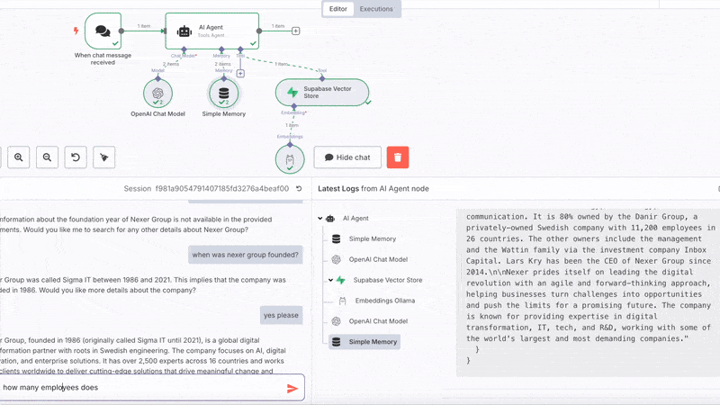

# ---- GENERAL COMMENTS: ----

* great content
* we should also think about (again) splitting it into two versions
  * a short seller for non-tech people
  * a more detailed technical writeup
* the intro could be more punchy by highlighting / emphasising that this is not
just a RAG but a tool to turn any web-domain into a conversational DB
  * this would make it distinguishable from all the other RAG stuff
  * especially useful for the aforementioned non-tech audiences
* could be made more reader friendly with a few tweaks
  * long code blocks could be broken-up with the text explanations
  * a short abstract of building steps could be added
  * the end result should be shown (i.e. a conversation with the crawled data)
    * this could also be shown at the very beginning, so even people who do not
    intend to read fully can see its effect
* I would go as far as cutting most technical details which are not directly
related to setting up the vector DB and the infrastructure on `n8n`.


TODO make image:

Ollama logo <-> n8n logo with agent <-> supabase logo <-> crawl4ai

# ---- COMMENT END ----

# A simple RAG on crawled data
combining crawl4AI , supabase and n8n

# ---- COMMENT: add the punchy intro about chat-w/-domain here ----


## **Retrieval-Augmented Generation (RAG) - A brief overview**

Retrieval-Augmented Generation (RAG) is a powerful technique that combines the
generative strength of large language models (LLMs) with the precision of
retrieval-based systems. Instead of relying solely on a model’s internal
knowledge, RAG pipelines dynamically pull in relevant external data—like
documents, websites, or databases—at query time. This dramatically improves
the factual accuracy and adaptability of LLMs, especially in domain-specific
or frequently updated contexts.

At its core, a RAG workflow retrieves contextually relevant chunks of
information using semantic search (typically via vector embeddings), then
passes this context along with the user’s question into an LLM. The result is a
grounded, contextualized answer that’s both coherent and informed by up-to-date
data. Whether you're building an internal knowledge assistant or a
public-facing chatbot, RAG helps ensure your AI is informed, not just
intelligent.


# ---- COMMENT ----

I'd keep only one of the below (could split for article types): either the
short bulletpoints list or the more detailed subtitles listing, but not both.
Or, in the long technical article, have the bullet points and move the longer
descriptions to where the tools are being used with code / examples. That would
be good for signposting.

# ---- COMMENT END ----

## The services and tech needed to crawl a website and chat with the content
We'll briefly cover the various parts of our RAG prototype made of:
- A **Supabase** database to hold the data (hosted by supabase so n8n can
access it remotely)
- **n8n** to create a workflow with a chat and AI agent functionality
- A python repo to run **Crawl4AI** locally and embed the documents using a
local ollama container REF CRAWLER article 
- An **Ollama** service deployed on **Digital Ocean** (so n8n can access it
remotely) REF OLLAMA-DO ARTICLE


### n8n
[**n8n**](https://n8n.io/) is an open-source, low-code workflow automation tool
that allows you to connect APIs, services, and custom logic with ease. It
provides a visual interface where users can build complex automation pipelines
by simply dragging and dropping nodes. With native support for hundreds of
integrations and the ability to run JavaScript code or call webhooks, n8n is a
powerful platform for orchestrating data flows—perfect for building
Retrieval-Augmented Generation (RAG) applications that combine scraping,
embedding, storage, and AI querying into a seamless process. You can either use
the hosted version or self-host wherever you like. Sign-up and start automating 


### Supabase 
[**Supabase**](https://supabase.com/) is an open-source backend-as-a-service
that offers a powerful alternative to Firebase, built on top of PostgreSQL. It
provides a fully managed database, real-time subscriptions, authentication,
storage, and RESTful or GraphQL APIs out of the box. With a developer-friendly
interface and tight integration with modern toolchains, Supabase is ideal for
hosting and querying embedded data in RAG applications, enabling fast,
scalable, and secure data access.

## Implementation of a RAG in n8n

Now let's dive straight into the implementation. 
We'll setup two tables in supabase and create an n8n workflow 
with an AI Agent that can use it as a tool.

### Pre-requisites
You'll need to set up a few accounts
- [n8n](https://n8n.io/) account
- Supabase: [Sign up](https://supabase.com/) and start a new project
- OpenAi account and API key. This is **optional**, you can also use other chat models in the agent.

Since the embeddings that will be created by our crawler are made with an Ollama model and we will be running n8n remotely, we need **an **Ollama** service deployed remotely**. Follow our tutorial (REF OLLAMA-DO article) to set up ollama remotely on Digital Ocean.


### Supabase init
We start with a SQL file that sets up the foundational schema for using
Supabase as a vector database to support RAG. We split it into three part here, to make it more readable.

First, we enable the `pgvector` extension, which allows for storing and 
querying high-dimensional vectors—essential for working with embeddings from 
language models. We then create two tables. One, `crawled_pages`, which stores
raw and processed data from web crawls (including HTML, markdown, and
metadata):
```sql
-- Enable the pgvector extension to work with embedding vectors
create extension vector;

-- Create a table to store page dats
drop table if exists crawled_pages;
create table crawled_pages (
  url text,
  created_at TIMESTAMP DEFAULT NOW(),
  links jsonb,
  metadata jsonb,
  markdown text,
  html text,
  cleaned_html text
);
```

The second table we create is `documents`, which holds the actual vectorized 
content used for semantic search, along with metadata and embeddings of 
dimension 768. We set the dimension to 768 because we will be using the
[nomic-embed-text](https://ollama.com/library/nomic-embed-text) model for 
creating our embeddings.
```sql
-- Create a table to store your documents
drop table if exists documents;
create table documents (
  id bigserial primary key,
  content text, -- corresponds to Document.pageContent
  metadata jsonb, -- corresponds to Document.metadata
  embedding vector(768) -- 768 is the dimension of the embedding
);
```

The final part of the script defines a custom SQL function: `match_documents`. 
It performs a vector similarity search using the `<=>` operator to compute cosine
distance between the query embedding and stored document embeddings. 
It supports optional filtering based on JSON metadata and returns the most similar
documents sorted by relevance. 
This function enables efficient retrieval of contextually relevant 
content for use in our RAG pipeline.


```sql
-- Create a function to search for documents
create function match_documents (
  query_embedding vector(768),
  match_count int default null,
  filter jsonb DEFAULT '{}'
) returns table (
  id uuid,
  content text,
  metadata jsonb,
  similarity float
)
language plpgsql
as $$
#variable_conflict use_column
begin
  return query
  select
    id,
    content,
    metadata,
    1 - (documents.embedding <=> query_embedding) as similarity
  from documents
  where metadata @> filter
  order by documents.embedding <=> query_embedding
  limit match_count;
end;
$$;
```

To run the script open the `SQl Editor` in your Supabase project, paste the 
snippets and click `RUN`.


### The n8n RAG workflow
The n8n workflow is straightforward 
- A chat node 
- An AI Agent connected to an OpenAi Chat Model (set up with your credentials, you can also pick another model and provider)
- Simple memory 
- Supabase Vector Store tool using Ollama Embeddings


Selecting and connecting the nodes is the easy part and done in a second. 
We'll now walk through configuring them.

#### Setting up the Supabase Vector Store node


To set up the Supabase Vector Store node in n8n you need to:
- Provide `SUPABASE_URL` as `Host` and `SUPABASE_KEY` as 
`Service Role Secret` in the `Credential to connect with...` sub-menu 
- Write a good description for your agent to understand when and how to use the 
vectorstore tool
- Select the `documents` table that holds the embeddings

>**NOTE**: The default SQL function that will be called to find documents is `match_documents`, which is why we initialized and defined it in Supabase earlier.

#### Setting up Ollama embeddings
By default n8n's `Embeddings Ollama` node is set to send requests to an Ollama
service running on `localhost`. Since we are using a remote `n8n` instance,
we don't need have a localhost and we'll configure the node to send requests to
our Ollama app hosted on Digital Ocean.


For configuring:
- Set the model to the same one used to create the embeddings (and the one
pulled to the Ollama app).
- Click the edit button of `Credential to connect with` 
- Set the Base URL with the URL from your remote ollama service 

>**NOTE**: Check out our quick tutorial to setup up an Ollama endpoint remotely on Digital Ocean (REF OLLMA ARTICLE).


# ---- COMMENT: START ----
## Signpost
Now we have set up everyhting we need.... only the data is missing bla bla 
need to crawl 
# ---- COMMENT: END ----

## Run the crawl 
Last step is setting up the cralwer environment and we are ready to run the
crawl and start chatting with your data.


## First results
If you open your Supabase project you should start seeing the `crawled_pages` 
as well as the `documents` tables being populated. 

Go back to your n8n workflow, open the chat of the chat node and should be able
to ask questions and get answers!





## Next steps 
Why not make your agent smarter and add the wikipedia tool node in n8n?!


