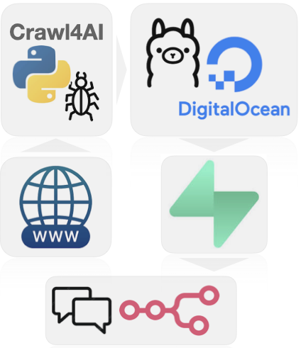

# **Beyond Typical RAG: Chat with the Full Content of Any Website**
Most RAG tutorials stop at a few documents. This guide shows you how to crawl, embed, and interact with entire domains using open-source tools like Crawl4AI, Supabase, n8n, and Ollama.

## **Retrieval-Augmented Generation (RAG) - A brief overview**

**Retrieval-Augmented Generation (RAG)** is an advanced approach that makes AI smarter and more reliable by combining two strengths: the creativity of language models and the accuracy of real-world information. Instead of depending only on what the AI already "knows," RAG helps it look up relevant facts—like searching through documents, websites, or databases—right when you ask a question.

Here's how it works: when you ask something, the system first finds pieces of information related to your question. Then, it gives that information to the AI, which uses it to write a more accurate, clear, and up-to-date response.

This means that whether you're building a helpful assistant for your team or a customer-facing chatbot, RAG helps ensure your AI gives answers that are not just well-written—but actually grounded in real, current knowledge.

This tutorial is a quick overview of setting up a domain aware RAG with only opensource tools. The more detialed guides are referenced throughout. 

## The services and tech needed to crawl a website and chat with the content
We'll briefly cover the various parts of our RAG prototype made of:
- a python repo to run [**Crawl4AI**](https://docs.crawl4ai.com/) locally and embed the documents using a
local ollama container
- a [**Supabase**](https://supabase.com/) database to hold the data (hosted by supabase so n8n can
access it remotely)
- [**n8n**](https://n8n.io/) to create a workflow with a chat and AI agent functionality
- a [**Ollama**](https://ollama.com/) service deployed on [**DigitalOcean**](https://www.digitalocean.com/) (so n8n can access it
remotely)

### n8n
[**n8n**](https://n8n.io/) is an open-source, low-code workflow automation tool
that allows you to connect APIs, services, and custom logic with ease. It
provides a visual interface where users can build complex automation pipelines
by simply dragging and dropping nodes. With native support for hundreds of
integrations and the ability to run JavaScript code or call webhooks, n8n is a
powerful platform for orchestrating data flows—perfect for building
Retrieval-Augmented Generation (RAG) applications that combine scraping,
embedding, storage, and AI querying into a seamless process. You can either use
the hosted version or self-host wherever you like. Sign-up and start automating.

### Supabase 
[**Supabase**](https://supabase.com/) is an open-source backend-as-a-service
that offers a powerful alternative to Firebase, built on top of PostgreSQL. It
provides a fully managed database, real-time subscriptions, authentication,
storage, and RESTful or GraphQL APIs out of the box. With a developer-friendly
interface and tight integration with modern toolchains, Supabase is ideal for
hosting and querying embedded data in RAG applications, enabling fast,
scalable, and secure data access.

To set up n8n and supabase checkout the indepth article REFTO_N8N_SUPABASE.

### Crawl4AI
[**Crawl4AI**](https://docs.crawl4ai.com/) is a lightweight, open-source web
crawling framework designed specifically for AI and machine learning use cases.
It simplifies the process of extracting structured content from websites,
making it easy to gather high-quality text data for tasks like training models
or building RAG pipelines. With built-in support for filtering, rate limiting,
and customizable parsing logic, Crawl4AI is ideal for developers looking to
integrate clean, domain-specific data into LLM workflows.

To set up the crawler checkout the indepth article REFTO_CRAWLER.

### LLaMA and ollama
[**LLaMA (Large Language Model Meta AI)**](https://www.llama.com/) is a powerful family of open-source AI models that can understand and generate human-like text. What makes LLaMA special is that it's designed to be fast and efficient, so it can run on local machines without needing expensive cloud services. It's especially useful for building tools like chatbots, search assistants, or text summarizers that respect user privacy and don’t require sending data to outside servers.

[**Ollama**](https://ollama.com/) is a simple tool that makes it easy to run LLaMA and similar AI models on your own computer. Instead of dealing with complicated setup steps, Ollama lets you start using these models with just a few quick commands. It’s ideal for developers who want to add AI to their apps or workflows—like automating tasks or analyzing text—without depending on big tech platforms. With Ollama, you get more control over how your AI runs and where your data stays.

### Digital Ocean
**DigitalOcean** is a cloud service that makes it easy to run websites, apps, or tools on the internet. It’s popular for its simple setup and affordable pricing—often around \$20 per month. You can use it to host powerful tools like AI models without needing your own server hardware.

In this case, we’ll use DigitalOcean to run our AI setup by uploading a file (called a Docker file) from a GitHub project. This lets us quickly deploy everything we need to get the system running smoothly in the cloud.

To set up an ollama endpoint on DigitalOcean checkout the indepth article REFTO_OLLAMA_DO.

## Implementation
### Pre-requisites
- [n8n](https://n8n.io/) account
- Supabase: [Sign up](https://supabase.com/) and start a new project
- [Digital Ocean](https://www.digitalocean.com/) account
- OpenAi account and API key 

### **Supabase setup**
We begin with a setup file that prepares Supabase (a backend service) to work as a **smart search database** for our AI system. This setup lets us store and search information in a way that makes sense to language models.

First, we turn on a feature called `pgvector`, which allows the database to handle special data types called *embeddings*—these are how AI models understand and represent text-essentially a list of N numbers $[0.5897541046142578,...,0.48047590]$ where N is referred to as the size of the embedding. Then, we create two key tables:

* One called **`crawled_pages`** stores site level data
* The second, **`documents`**, holds the transformed content that the AI can search through. This includes both the text and its embedding

We set the embedding size to 768, because we’ll be using a Llama model called **nomic-embed-text**, which creates these AI-friendly representations of text.

The script and more detail on setting up SupaBase is found here(LINK TO SUPABASE ARTICLE).

### **Crawler**
The crawler component orchestrates the full web crawling and document embedding
pipeline using `crawl4ai`, Supabase, and a local embedding model. It 
- crawls a target website (e.g., `https://nexergroup.com`) 
- follows all links within the same domain
- extracts and cleans HTML content
- processes the results into 
  - **`crawled_pages`**: site specific data e.g. cleaned html, metadata, internal external links and social media data ([Open Graph data](https://ogp.me/))
  - **`documents`**: page content in semantically meaningful text chunks using HTML headers, and their embeddings from the **nomic-embed-text** model 

### How to Launch an AI App on DigitalOcean Using a GitHub File

Let’s walk through how to put a basic AI app online using **DigitalOcean** and a special setup file (called a *Dockerfile*) stored on **GitHub**.

#### What This Dockerfile Does

We’ll start by creating a GitHub project that contains a file with instructions to run an AI tool called **Ollama**. This tool lets us use a language model to understand or analyze text.

The file:

* Downloads and prepares the AI model (by default, it uses one called [`nomic-embed-text`](https://ollama.com/library/nomic-embed-text)).
* Gets the system ready to serve the model so we can connect to it from other tools.

**Note:** This setup is great for testing or small projects, but it’s **not meant for production**—it doesn’t include security features like encryption or user logins.

If you need security (like API keys), the Ollama team recommends adding a middle layer called a **reverse proxy**. [This article](https://medium.com/@qdrddr/ollama-with-apikey-litellm-proxy-c675c32ce7e8) explains how to do that.

The Dockerfile and more details on DigitalOcean deployment can be found here (REF TO OLLAMA_DO article)

#### Putting It Online with DigitalOcean

To get your AI app running on the web:

1. Go to [DigitalOcean](https://www.digitalocean.com/) and log in.
2. Create a new **project**.
3. Click **Create > App Platform**.
4. Connect your GitHub account.
5. Select the GitHub repo with your Dockerfile.

> Tip: We recommend choosing **1 container with 2GB of RAM** — it costs around \$25/month and gives you better performance than the default (which is 2 smaller containers).

6. Change the default web port from **8080** to **11434**, which is the port Ollama uses.

Once you click **Create App**, your AI app will be live! You’ll get a public URL—save this, as you’ll need it if you're using tools like **n8n** to connect to your app.

Any time you update your code and push it to GitHub, DigitalOcean will **automatically rebuild and redeploy** your app.

### The n8n RAG workflow
The n8n workflow is straightforward, a chat node, an AI Agent connected to
OpenAi Chat Model (set up with your credentials), simple memory and the 
Supabase Vector Store tool using Ollama Embeddings.

Selecting and connecting the nodes is the easy part and done in a second. We'll 
now walk through configuring them.

#### Setting up the Supabase Vector Store node

To set up the Supabase Vector Store node you need 
- to provide `SUPABASE_URL` as `Host` and `SUPABASE_KEY` as 
`Service Role Secret` in the `Credential to connect with...` sub-menu 
- write a good description for your agent to understand when and how to use the 
vectorstore tool
- select the `documents` table that holds the embeddings

>**NOTE**: The default SQL function that will be called to find documents is `match_documents`, which is why we initialized and defined it in Supabase earlier.

#### Setting up Ollama embeddings
By default n8n's `Embeddings Ollama` node is set to send requests to an Ollama
service running on `localhost`. Since we are using a remote `n8n` instance,
we don't need have a localhost and we'll configure the node to send requests to
our Ollama app hosted on Digital Ocean.

For configuring:
- set the model to the same one used to create the embeddings (and the one
pulled to the Ollama app).
- click the edit button of `Credential to connect with` 
- set the Base URL with the URL from your Digital Ocean app.

## Run the crawl 
Last step is setting up the cralwer environment and we are ready to run the
crawl and start chatting with your data. Follow the steps here (REF TO CRAWLER article) to 
- Install python virtual environment
- Set up Crawl4AI
- Get Ollama running locally
- Start the crawl

As soon as the crawler is running, the first pages will start being processed. If you open your Supabase project you should start seeing the `crawled_pages` 
as well as the `documents` tables being populated. 

## Chat with your domain
Go over to your n8n workflow, open the chat of the chat node and should be able
to ask questions and get answers!

## Conclusion
This guide covered the essentials—from crawling and embedding web content, to deploying your model with Docker, to connecting it all in n8n. Now you're ready to build AI workflows that are not just powerful—but fully yours.

